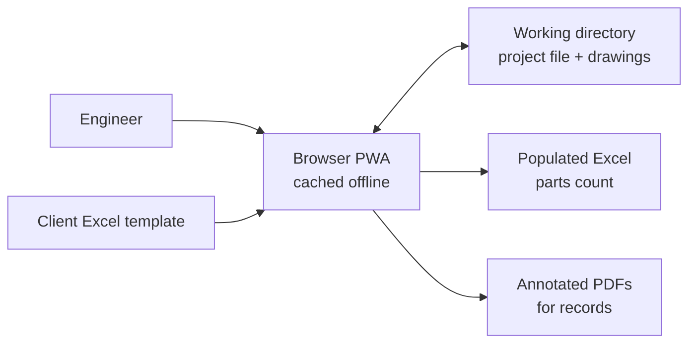

# QRA Parts Count Tool

An offline-first web application for **Quantitative Risk Assessment (QRA) parts counts**. A risk
engineer uses it to mark up PEFS and P&ID drawings, define isolatable segments between ESD valves,
count leak-source equipment by type and size, and export the results to the client's own Excel
template, along with annotated PDF drawings for the record.

The app is a single-page **Progressive Web App**. After the first load it runs entirely in the
browser with **no server and no internet connection**. It reads and writes files directly in a
local _working directory_ that the user picks. No project data (drawings, counts, notes, templates
or exports) ever leaves the browser.

> The full requirements are in the [Functional Design Specification](docs/FDS.md), and the delivery
> plan is in the [Development Roadmap](docs/ROADMAP.md). Requirement IDs such as `PRJ-04` or
> `CNT-06` in the code, tests and commit messages trace back to those documents.

---

## Contents

- [Features](#features)
- [How it works](#how-it-works)
- [Getting started](#getting-started)
- [Scripts](#scripts)
- [Testing](#testing)
- [Project structure](#project-structure)
- [Working directory and project file](#working-directory-and-project-file)
- [Privacy, security and offline operation](#privacy-security-and-offline-operation)
- [Browser support](#browser-support)
- [Deployment](#deployment)
- [Roadmap status](#roadmap-status)
- [Contributing](#contributing)

---

## Features

| Area          | What the user can do                                                                                                                                                     | FDS ref |
| ------------- | ------------------------------------------------------------------------------------------------------------------------------------------------------------------------ | ------- |
| Project       | Create or open a project in a local folder; autosave within 2 s; 20 rolling backups; undo/redo                                                                           | PRJ     |
| Drawings      | Import PDF (one drawing per page), DWG, DXF and PDF plots; drawing register with editable metadata; pan, zoom, rotate, minimap                                           | DRW     |
| Markup        | Circle and dashed-highlight markers stored in drawing coordinates; select, move, resize, copy/paste, box-select; labels, tooltips and filters                            | ANN     |
| Segments      | ESDV markers; isolatable segments with process data, colour and status; many-to-many links to drawings; configurable ESDV boundary rule                                  | SEG     |
| Parts count   | User-defined equipment library and bin sets; quick item entry; automatic size binning; live segment and project count tables; duplicate-tag check; optional pipe lengths | CNT     |
| Notes         | Formatted segment notes with timestamps and author initials                                                                                                              | NTE     |
| Drawing links | Hotspots that jump between drawings, with Back history; never exported                                                                                                   | LNK     |
| Export        | Pre-export checks; populate the client's Excel template (four layout modes); annotated vector PDFs with legend and stamp; CSV item list; export log                      | EXP     |

## How it works



A parts count runs in six stages. The user can move back and forth freely, and every change
autosaves:

1. **Set up the project**: pick a working folder and enter the project metadata and counting rules.
2. **Import drawings**: PDF, DWG or DXF files are copied into `drawings/` and listed in the
   register.
3. **Mark ESDVs and define segments**: create segments such as `IS-01`, link them to drawings and
   outline their extent.
4. **Count parts**: with a segment active, place a circle on each leak source and enter its type,
   size, actuation, tag and quantity.
5. **Add notes and drawing links**: record assumptions, and link off-page connectors to the
   continuation drawing.
6. **Export**: run the pre-export check, then write the Excel workbook and the annotated PDFs to
   `exports/<timestamp>/`.

### Technology

| Layer        | Choice                                                                                        |
| ------------ | --------------------------------------------------------------------------------------------- |
| App shell    | React 19 + TypeScript (strict), built with Vite                                               |
| Offline      | Service worker (Workbox via `vite-plugin-pwa`) that precaches every asset                     |
| Styling / UI | Tailwind CSS 4 with CSS-variable design tokens, shadcn/ui on Radix UI, lucide-react icons     |
| State        | Zustand + Immer, with command-pattern (patch-based) undo/redo                                 |
| Validation   | Zod schemas for the project file; JSON Schema generated from them                             |
| File access  | File System Access API; IndexedDB for remembered folder handles                               |
| PDF viewing  | PDF.js (code-split, loaded on first use)                                                      |
| CAD viewing  | Own DXF parser; LibreDWG (WebAssembly) for native DWG, in an isolated worker; canvas renderer |
| Excel        | ExcelJS (writes into the client template, keeping its formatting and formulas)                |
| PDF export   | pdf-lib (draws markers as vector content onto copies of the originals)                        |
| i18n         | i18next; English in v1, with strings externalised for later Arabic (RTL) support              |
| Tests        | Vitest + React Testing Library (unit), Playwright on Chromium (end-to-end, including offline) |

## Getting started

### Prerequisites

- **Node.js 22 LTS** (see `.nvmrc`)
- **pnpm 10** (`corepack enable` will provide the pinned version from `package.json`)
- **Microsoft Edge or Google Chrome** (current release) for running the app

### Install and run

```bash
pnpm install
pnpm dev            # starts the dev server on http://localhost:5173
```

Open the URL in Edge or Chrome, choose **New project**, and pick an empty folder as the working
directory.

### Production build

```bash
pnpm build          # type-checks and writes static files to dist/
pnpm preview        # serves dist/ on http://localhost:4173 (service worker enabled)
```

## Scripts

| Command                             | Purpose                                                                                           |
| ----------------------------------- | ------------------------------------------------------------------------------------------------- |
| `pnpm dev`                          | Vite dev server with hot reload                                                                   |
| `pnpm build`                        | Type-check (`tsc -b`) and build static files into `dist/`                                         |
| `pnpm preview`                      | Serve the production build locally                                                                |
| `pnpm typecheck`                    | TypeScript project build in strict mode                                                           |
| `pnpm lint`                         | ESLint with zero warnings allowed                                                                 |
| `pnpm format` / `pnpm format:check` | Prettier write / check                                                                            |
| `pnpm test`                         | Vitest unit and component tests                                                                   |
| `pnpm test:watch`                   | Vitest in watch mode                                                                              |
| `pnpm test:coverage`                | Unit tests with V8 coverage                                                                       |
| `pnpm test:e2e`                     | Playwright end-to-end tests against the production build, including an offline run                |
| `pnpm schema`                       | Regenerate the project file JSON Schema in `docs/schema/` from the Zod schemas                    |
| `pnpm size`                         | Check the bundle-size budget (initial JavaScript under 1.5 MB gzipped)                            |
| `pnpm spike:dwg <folder> [out.md]`  | Run the DWG/DXF readers on every drawing in a folder and report fidelity and speed (roadmap #12)  |
| `pnpm verify`                       | Run the whole local quality gate: lint, format, typecheck, unit tests, build, size budget, e2e    |
| `pnpm package:site`                 | Zip `dist/` with a one-line local server script, as the static site for intranet or local hosting |

This project has **no hosted CI/CD pipeline**. `pnpm verify` is the local equivalent of a CI build
and should pass before every commit is pushed.

## Testing

### Unit and component tests

```bash
pnpm test
```

Unit tests sit beside the code they test (`*.test.ts` / `*.test.tsx`). They cover the domain logic
(schemas and migrations, size parsing, binning, counting, duplicate detection, the Excel and PDF
writers), the store (undo/redo, autosave, backups) and the UI components. File-system code is
tested against an in-memory implementation of the File System Access API (`src/test/memory-fs.ts`).

### End-to-end tests

```bash
pnpm build
pnpm test:e2e
```

The Playwright suite in `e2e/` runs against the production build served by `vite preview` on
Chromium. It includes:

- **Offline run (NFR-01)**: `e2e/offline.spec.ts` loads the app once, takes the browser context
  offline, and checks that the app reloads from the service-worker cache. The `chromium-offline`
  project then re-runs every other test with the network disabled after the first load.
- **No data egress**: every request is recorded and must go to the app's own origin, and the
  Content Security Policy must be present.
- **Workflow tests** that drive the UI against a working directory backed by the browser's Origin
  Private File System. The native folder picker is replaced by a test hook, because Playwright
  cannot drive native dialogs.
- **Performance (NFR-02, NFR-03)**: the `perf` project opens dense A1 PDF and DXF sheets and
  checks they display in under 3 s, and pans and zooms a sheet with 2,000 markers while
  recording frame times. It runs after the other projects, one test at a time. Run it alone with
  `pnpm test:e2e --project perf --no-deps`. Results and method are in
  [`docs/performance.md`](docs/performance.md).

Test drawings are generated, not hand-made: `node scripts/generate-fixtures.mjs` (PDF) and
`node scripts/generate-cad-fixtures.mjs` (DXF) write `e2e/fixtures/`; the heavy performance
sheets are generated on demand into `.cache/perf/`.

Playwright is pinned to the version whose Chromium build is installed. On a new machine, run
`pnpm exec playwright install chromium` once. To use a different Chromium binary, set
`PLAYWRIGHT_CHROMIUM_EXECUTABLE=/path/to/chrome`.

## Project structure

```
.
├── docs/
│   ├── FDS.md                  Functional Design Specification (source of requirement IDs)
│   ├── ROADMAP.md              Development roadmap with per-task status
│   ├── schema/                 Generated JSON Schema for project.qrapc.json
│   ├── spikes/                 Technical spike reports (e.g. DWG renderer selection)
│   ├── performance.md          Performance method and results (NFR-02, NFR-03)
│   └── user-guide.md           User guide and keyboard shortcuts
├── e2e/                        Playwright end-to-end tests
├── public/                     Static assets copied verbatim (icons, headers)
├── scripts/                    Build helpers: JSON Schema, bundle-size budget, site packaging
└── src/
    ├── app/                    App shell: header, three-pane layout, status bar, dialogs
    ├── components/ui/          shadcn/ui components (code-owned)
    ├── domain/                 Pure, framework-free logic: schemas, sizes, bins, counting, checks
    ├── features/               Feature modules (project, drawings, markup, segments, count, …)
    ├── i18n/                   i18next set-up and English strings
    ├── lib/                    Shared utilities (file system, hashing, ids, IndexedDB)
    ├── store/                  Zustand stores, undo/redo history, autosave
    ├── styles/                 Tailwind entry point and design tokens
    └── test/                   Test set-up and helpers
```

## Working directory and project file

All project state lives in one versioned JSON file. The drawings sit beside it, so copying the
folder copies the whole study.

```
<working directory>/
├── project.qrapc.json        project file (autosaved)
├── drawings/                 imported PDF, DWG and DXF files, unmodified
├── cache/                    CAD display lists and drawing previews (rebuildable)
├── templates/                copy of the client Excel template + mapping
├── exports/                  Excel and annotated PDF outputs, timestamped
└── .backup/                  last 20 autosave snapshots
```

- **Autosave** writes to `project.qrapc.json.tmp` first and then replaces the project file, so a
  crash never leaves a half-written file (PRJ-04). If the app finds a newer, complete temporary file
  when it opens a project, it offers to recover it.
- **Backups**: the last 20 snapshots are kept in `.backup/`, and the user can restore one from
  Settings (PRJ-05).
- **Schema**: the file carries `schemaVersion`. Opening an older file runs a migration and first
  keeps a backup of the original. The JSON Schema generated from the Zod definitions is in
  [`docs/schema/`](docs/schema).
- **Derived data is not stored**: size bins are recalculated from the item size and the bin set
  every time, so each total can be reproduced from the item list (NFR-09).

## Privacy, security and offline operation

- **No network at runtime.** After the first load, the only requests the app makes are for its
  own static files. There is no telemetry, analytics or error reporting.
- **Content Security Policy.** The production `index.html` carries the FDS policy
  `default-src 'self'; connect-src 'self'; worker-src 'self' blob:; img-src 'self' blob: data:`,
  plus hardening directives, so the browser itself blocks any request to a third-party origin. The
  policy is defined once in [`scripts/csp.mjs`](scripts/csp.mjs) and is also emitted as a
  `_headers` file for static hosts and sent by the packaged local server. The only additions are
  `'wasm-unsafe-eval'` (bundled WebAssembly decoders) and inline styles (injected by UI libraries);
  neither allows another origin. Scripts under `workers/` get their own policy that also allows
  `'unsafe-eval'`, which the WebAssembly DWG reader's generated bindings need; it still allows
  no other origin. ESLint rules forbid `XMLHttpRequest`, `WebSocket`, `EventSource` and
  `navigator.sendBeacon`.
- **Verified by tests.** Every Playwright test fails if the page requests anything outside the
  app's origin, and `e2e/privacy.spec.ts` checks that the browser blocks third-party requests.
- **Everything is bundled.** Fonts (Inter and JetBrains Mono via `@fontsource`), icons and all
  libraries are in the build. Nothing loads from a CDN.
- **Offline.** The service worker precaches the full app, including web workers, WASM and fonts.

## CAD drawings (DWG and DXF)

- **DXF** is read by the app's own parser (no third-party code).
- **Native DWG** (R13 to 2018) is read by [LibreDWG](https://www.gnu.org/software/libredwg/)
  compiled to WebAssembly (`@mlightcad/libredwg-web`). It runs in a separate web worker, with a
  fresh instance for each file, and is loaded only when a `.dwg` is imported.
- Both produce one neutral model. Each model space or layout can be imported as a drawing; its
  display list is cached gzipped in `cache/cad/`, so a DWG is parsed once.
- Entities the readers cannot show (for example MULTILEADER and tables) are listed in the spike
  report. For such drawings, import the PDF plot instead; it is flagged as a CAD plot.

The selection is documented in [`docs/spikes/dwg-renderer.md`](docs/spikes/dwg-renderer.md).

> **Licence note.** LibreDWG and `@mlightcad/libredwg-web` are licensed under **GPL-3.0**.
> Distributing a build that includes them has licence obligations; whether the worker boundary
> is sufficient is a decision for the product owner. `VITE_DWG_READER=none pnpm build` produces a
> build without any GPL code: native `.dwg` import then reports that the reader is not included,
> and DXF and PDF plots still work.

## Browser support

| Browser                                                    | Support                                                                          |
| ---------------------------------------------------------- | -------------------------------------------------------------------------------- |
| Microsoft Edge, Google Chrome (last two releases, desktop) | Full read/write access to a local working directory                              |
| Firefox, Safari                                            | Read-only fallback: open a project from a `.zip`, export a `.zip` (roadmap v1.2) |

The app is designed for desktop use, with a minimum screen of 1366 × 768 and mouse or pen input.

## Deployment

The build output in `dist/` is a set of static files with no backend. The same build is served in
two ways:

1. **Public URL**: host `dist/` on any static web host. Serve it over HTTPS.
2. **Zipped static site**: `pnpm package:site` writes `release/qra-parts-count-tool-<version>.zip`.
   Unzip it and run the included `serve.mjs` script (`node serve.mjs`) to serve it on
   `http://localhost:8080`.

Browsers allow service workers and folder access only in a secure context, so the app must be
served over `https://` or `http://localhost`. Opening `index.html` as `file://` will not work.

## Roadmap status

Progress against the [roadmap](docs/ROADMAP.md). The detailed per-task status is kept in that file.

| Version       | Theme                                                       | Status  |
| ------------- | ----------------------------------------------------------- | ------- |
| 0.1.0         | Foundation: project scaffold and offline shell              | Done    |
| 0.2.0         | Working directory, project file and PDF viewing             | Done    |
| 0.3.0         | DWG support                                                 | Done ¹  |
| 0.4.0         | Markup engine                                               | Done    |
| 0.5.0         | Isolatable segments                                         | Done    |
| 0.6.0         | Parts count                                                 | Done    |
| 0.7.0         | Segment notes and drawing links                             | Planned |
| 0.8.0         | Excel template mapping and export                           | Planned |
| 0.9.0         | Annotated PDF export and pre-export checks                  | Planned |
| 1.0.0         | First production release                                    | Planned |
| 1.1.0 – 2.0.0 | Productivity, revisions, navigation aids, assisted counting | Planned |

¹ The DWG reader choice is provisional until it is re-run on the client's sample drawings and the
GPL question is decided (see the licence note above).

## Contributing

- Use **pnpm** and commit the lockfile.
- Keep TypeScript `strict` clean and ESLint at zero warnings. Format with Prettier.
- Put pure logic in `src/domain/` with unit tests, and keep React components thin.
- Reference requirement IDs (e.g. `CNT-05`) in tests and commit messages where they apply.
- Put every user-facing string in `src/i18n/locales/en.json` (NFR-08), and use logical CSS
  properties (`ms-`/`me-`, `ps-`/`pe-`) so the layout can mirror for RTL.
- Never add a runtime dependency that makes network requests or loads from a CDN.
- Run `pnpm verify` before pushing.
