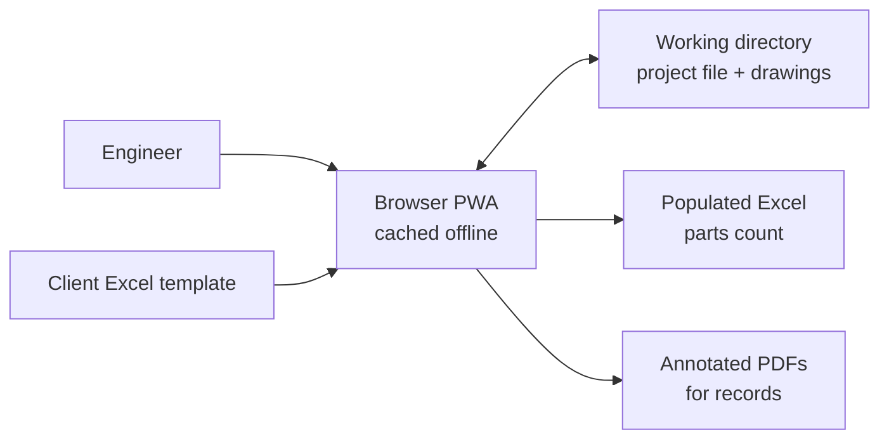
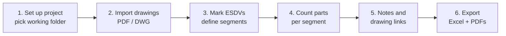

# QRA Parts Count Tool — Functional Design Specification

Sep 23, 2026 · Prepared by: Abdullah

## 1. Purpose and scope

The QRA Parts Count Tool is an offline-capable web application that lets a risk engineer mark up PEFS/P&ID drawings, define isolatable segments between ESD valves, count leak-source equipment by type and size, and export the result to the client's own Excel template plus annotated drawings for the record.

**In scope**

- Import of PDF and AutoCAD (.dwg) drawings into a local project working directory
- Drawing markup with a fixed marker set (circle, dashed highlight) and user-placed hyperlinks between drawings
- Definition of isolatable segments, each linked to one or more drawings
- Parts count per segment by equipment type, size bin and (for valves) actuation type
- Optional pipe length counting per segment and size bin, enabled by the user
- Free-text notes per segment
- Export to a user-supplied Excel template and to annotated PDF drawings
- Automatic saving of all work to a project file in the working directory

**Out of scope (v1)**

- Leak frequency calculation, consequence modelling or risk summation (the Excel template may do this downstream)
- Automatic symbol recognition on drawings (listed as a roadmap item)
- Multi-user concurrent editing of one project
- Editing the underlying drawing content

**Definitions**

| Term | Meaning |
| --- | --- |
| PEFS | Process Engineering Flow Scheme |
| P&ID | Piping and Instrumentation Diagram |
| QRA | Quantitative Risk Assessment |
| ESDV | Emergency Shutdown Valve; bounds an isolatable segment |
| Isolatable segment | Inventory that can be isolated between ESDVs; the unit of the parts count |
| Marker | An annotation placed on a drawing (circle or dashed highlight) |
| Count item | A marker tagged with an equipment type, size and attributes; one row of the count |
| Size bin | A configurable size range, e.g. 1" < x ≤ 2" |
| Drawing link | A user-placed hotspot that navigates to another drawing; never exported |
| Working directory | The local folder holding the project file and its drawings |

## 2. System overview and operating constraints

The tool is a single-page web app installed as a Progressive Web App (PWA): after the first load it runs entirely in the browser with no server and no internet connection, reading and writing files directly in a folder the user chooses.

**Users**

| Role | Needs |
| --- | --- |
| QRA / process safety engineer | Marks up drawings, defines segments, performs the count, writes notes, exports |
| Reviewer / checker | Opens the same project folder, reviews markers and notes, adds review notes |
| Tool administrator | Maintains equipment types, size bins and the Excel template mapping for a client or project |

**Operating constraints**

- **Offline first.** All code, fonts, PDF/DWG renderers and Excel libraries are cached by a service worker on first load. No feature may call a remote service at runtime.
- **Local working directory.** The user picks a folder via the browser File System Access API. The tool reads and writes the project file and drawings there; nothing is uploaded.
- **Supported browsers.** Chromium-based desktop browsers (Microsoft Edge, Google Chrome) current release. These are the browsers that support write access to a local folder. Firefox and Safari get a read-only fallback: open a project from a .zip, export a .zip.
- **Desktop only.** Minimum screen 1366 × 768; mouse or pen input. Tablet use is not a v1 target.
- **Data confidentiality.** No project data (drawings, counts, notes, templates, exports) ever leaves the user's browser. The app sends no telemetry, analytics or error reports, and makes no network request after load other than fetching its own static files.
- **Hosting.** The app is served from a public URL and is also shipped as a zipped static site for intranet or local hosting. Both builds are identical static files; neither has a backend. A strict Content Security Policy (`connect-src 'self'`, no third-party origins) enforces the no-data-transfer rule in the browser itself.

**Context**



The browser app is the only component; the working directory is the single source of truth.

## 3. User workflow

A parts count runs in six stages; the user can move back and forth freely, and every change autosaves.



1. **Set up project.** User creates a new project or opens an existing one by choosing a working directory. A new project asks for project name, client, facility, study reference and the Excel template.
2. **Import drawings.** User adds PDF or DWG files. The tool copies them into the working directory, reads drawing number, title and revision where possible, and lists them in the drawing register. The user corrects metadata as needed.
3. **Define isolatable segments.** User marks each ESDV on the drawings, then creates a segment (e.g. `IS-01`) with a text label and description. The user links the segment to every drawing it spans and outlines the segment's extent on each drawing with dashed highlights.
4. **Count parts.** With a segment active, the user places a circle marker on each leak source. Each marker opens a quick-entry panel: equipment type, nominal size, actuation (valves only), tag number and quantity. The tool bins the item by size and updates the segment totals live.
5. **Record notes and links.** User writes notes against each segment (assumptions, exclusions, boundary decisions). User places drawing links on off-page connectors so a click jumps to the continuation drawing.
6. **Export.** User runs a pre-export check (unassigned markers, empty segments, duplicate tags across drawings), then exports the populated Excel workbook and annotated PDFs into the working directory's `exports` folder.

## 4. Functional requirements

Requirements carry an ID for traceability to the roadmap and test cases; priority is Must (v1.0), Should (v1.x) or Could (later).

### 4.1 Project and working directory (PRJ)

| ID | Requirement | Priority |
| --- | --- | --- |
| PRJ-01 | User can create a new project by selecting an empty or existing folder as the working directory. | Must |
| PRJ-02 | The tool creates the folder structure in section 5 and a project file `project.qrapc.json`. | Must |
| PRJ-03 | User can open an existing project by selecting its working directory; the tool validates the project file and schema version. | Must |
| PRJ-04 | Every change autosaves to the project file within 2 s of the last edit, using write-to-temp-then-rename so a crash never leaves a half-written file. | Must |
| PRJ-05 | The tool keeps the last 20 autosave snapshots in `.backup/` and lets the user restore one. | Must |
| PRJ-06 | The tool remembers recently opened projects and re-requests folder permission on reopen. | Should |
| PRJ-07 | If another browser tab has the same project open, the second tab opens read-only and says so. | Should |
| PRJ-08 | User can export and import the whole project as a single .zip (for Firefox/Safari or for sending to a checker). | Should |
| PRJ-09 | Undo/redo for every markup and count action, at least 100 steps per session. | Must |

### 4.2 Drawing import and viewing (DRW)

| ID | Requirement | Priority |
| --- | --- | --- |
| DRW-01 | User can import one or many PDF files; multi-page PDFs are treated as one drawing per page. | Must |
| DRW-02 | User can import .dwg files; the tool renders model space or a chosen layout to a vector view. | Must |
| DRW-03 | Imported files are copied into `drawings/`; originals are never modified. | Must |
| DRW-04 | Each drawing has metadata: drawing number, sheet, title, revision, file hash. Title-block text is pre-filled where extractable and editable by the user. | Must |
| DRW-05 | Pan, zoom (to 3200%), fit-to-page, rotate, and a minimap for large sheets. | Must |
| DRW-06 | Multiple drawings open as tabs; split view shows two drawings side by side. | Should |
| DRW-07 | Replacing a drawing with a new revision keeps existing markers and flags them for review if the page size changed. | Should |
| DRW-08 | Text search within PDF drawings (tag numbers, line numbers) highlights hits. | Should |
| DRW-09 | DWG layer visibility toggles. | Could |
| DRW-10 | User can also import DXF files and PDF plots of DWG drawings as alternatives to native .dwg. Native .dwg import remains mandatory. | Must |

### 4.3 Markers and annotation (ANN)

| ID | Requirement | Priority |
| --- | --- | --- |
| ANN-01 | Marker set is fixed to: **circle** (point item) and **dashed highlight** (polyline or rectangle around a line run or area). | Must |
| ANN-02 | Markers are stored in drawing coordinates, so they stay aligned at every zoom level and on export. | Must |
| ANN-03 | Every marker belongs to exactly one segment and takes that segment's colour. | Must |
| ANN-04 | User can select, move, resize, copy, paste and delete markers; multi-select with box-drag. | Must |
| ANN-05 | Marker label (item ID or tag) shows beside the marker; label display can be toggled. | Must |
| ANN-06 | Filters show or hide markers by segment, equipment type, or unassigned status. | Must |
| ANN-07 | Hovering a marker shows its attributes; double-click opens the edit panel. | Must |
| ANN-08 | Keyboard shortcuts for each marker tool and each common equipment type. | Should |
| ANN-09 | Stamp mode: repeat the last item's attributes on each click for fast counting of like items. | Should |

### 4.4 Isolatable segments (SEG)

| ID | Requirement | Priority |
| --- | --- | --- |
| SEG-01 | User can mark an ESDV with a circle marker of type ESDV, including its tag and size. | Must |
| SEG-02 | User can create a segment with a unique text label (e.g. IS-01), description, colour, and optional fields: fluid, phase, operating pressure, operating temperature. | Must |
| SEG-03 | A segment records its bounding ESDVs (two or more). | Must |
| SEG-04 | A segment links to one or more drawings; a drawing can hold several segments. | Must |
| SEG-05 | The segment panel lists all linked drawings; clicking one opens that drawing zoomed to the segment's markers. | Must |
| SEG-06 | User sets one active segment; new markers go to it. | Must |
| SEG-07 | User can split, merge, rename and reorder segments; markers follow the change. | Should |
| SEG-08 | The user configures the ESDV boundary rule at project setup: count the ESDV in the upstream segment, the downstream segment, both, or neither. There is no fixed default, and the rule can be overridden per ESDV. | Must |
| SEG-09 | Segment status: Not started, In progress, Counted, Checked. | Should |

### 4.5 Parts count (CNT)

| ID | Requirement | Priority |
| --- | --- | --- |
| CNT-01 | Each count item records: segment, drawing, equipment type, nominal size, size unit (in or DN), quantity (default 1), tag, actuation (valves), and optional remarks. | Must |
| CNT-02 | Equipment types and the leak frequency dataset format they map to (e.g. IOGP 434-01, UK HSE HCRD or a client-specific scheme) are user-defined per project; no dataset is hard-coded. The starter library covers: valves, flanges, small-bore instrument connections, pumps, compressors, vessels, heat exchangers, filters, pig traps and other equipment. | Must |
| CNT-03 | Valves carry an actuation class: Manual or Automated (actuated / control / ESD). | Must |
| CNT-04 | The user creates and edits bin sets for each equipment category, at minimum automated valves, manual valves, flanges and small-bore instrument connections, each with its own bins and explicit edge rules, e.g. ≤ 1", 1" < x ≤ 2", 2" < x ≤ 3", 3" < x ≤ 6", 6" < x ≤ 11", > 11". | Must |
| CNT-05 | The tool assigns each item to its bin automatically; an item with no size is flagged as incomplete. | Must |
| CNT-06 | Live count table for the active segment: rows = equipment type (and actuation), columns = size bins, cells = totals. Clicking a cell highlights its markers. | Must |
| CNT-07 | Project-wide summary across all segments, in the same layout. | Must |
| CNT-08 | Duplicate check: the same tag counted on two drawings (e.g. at a match line) raises a warning the user can accept or resolve. | Must |
| CNT-09 | Flange counting convention is set per project: count per flanged joint or per flange face. | Must |
| CNT-10 | Bulk edit: change size, type or segment for a multi-selection of items. | Should |
| CNT-11 | Import and export of the equipment library and bin set as JSON, so the same rules apply across projects. | Should |
| CNT-12 | Pipe length counting is a user setting per project. When enabled, the user enters a length (m) on each dashed-highlight line run, with nominal size; lengths are summed per segment and size bin. Lengths are entered by hand because PEFS/P&IDs are not drawn to scale. | Must |

### 4.6 Segment notes (NTE)

| ID | Requirement | Priority |
| --- | --- | --- |
| NTE-01 | Each segment has a free-text notes field with basic formatting (bold, bullets). | Must |
| NTE-02 | Notes are timestamped entries with author initials, so reviewer comments stay separate from the counter's notes. | Should |
| NTE-03 | Notes export to the Excel output (see section 7). | Must |
| NTE-04 | A note can reference a marker; clicking the reference jumps to it. | Could |

### 4.7 Drawing links (LNK)

| ID | Requirement | Priority |
| --- | --- | --- |
| LNK-01 | User can draw a link hotspot (rectangle) on a drawing and point it at another drawing, optionally at a saved view (position and zoom). | Must |
| LNK-02 | Clicking a link opens the target drawing; a Back button returns to the previous view. | Must |
| LNK-03 | Links show as a distinct overlay style and can be hidden. | Must |
| LNK-04 | Links are never written to exported PDFs or Excel. | Must |
| LNK-05 | Link targets survive drawing revision replacement; broken targets are flagged. | Should |
| LNK-06 | Suggest links automatically from off-page connector text matching a drawing number in the register. | Could |

### 4.8 Export (EXP)

| ID | Requirement | Priority |
| --- | --- | --- |
| EXP-01 | Pre-export check lists: unassigned markers, items missing size or type, segments with no items, segments with no linked drawing, unresolved duplicates. User can export anyway. | Must |
| EXP-02 | Excel export fills the user's template per the mapping in section 7 and saves a new file; the template is never overwritten. | Must |
| EXP-03 | Annotated PDF export: one PDF per drawing, plus optional combined PDFs (one per segment, or all segments in one file with a bookmark per segment), with markers, labels, and a stamp (project, date, revision of count) above the legend in the top-left corner. | Must |
| EXP-04 | DWG drawings export as annotated PDFs at the chosen layout's paper size. | Must |
| EXP-05 | Export filenames follow a configurable pattern, e.g. `{project}_{segment}_{drawingNo}_{rev}.pdf`. | Should |
| EXP-06 | CSV export of the flat item list (one row per count item) for audit. | Should |

## 5. Data model and project file

All project state lives in one versioned JSON file in the working directory; drawings sit beside it, so copying the folder copies the whole study.

**Working directory layout**

```
<working directory>/
├── project.qrapc.json        project file (autosaved)
├── drawings/                 imported PDF and DWG files, unmodified
├── cache/                    rendered DWG views and thumbnails (rebuildable)
├── templates/                copy of the client Excel template + mapping
├── exports/                  Excel and annotated PDF outputs, timestamped
└── .backup/                  last 20 autosave snapshots
```

**Entities**

| Entity | Key fields | Relationships |
| --- | --- | --- |
| Project | id, name, client, facility, study ref, schemaVersion, settings (ESDV boundary rule, flange convention, pipe length counting on/off, units) | Has drawings, segments, library, template mapping |
| Drawing | id, fileName, fileHash, fileType (pdf/dwg), page or layout, drawingNo, sheet, title, revision | Has markers and links; linked to many segments |
| Segment | id, label (e.g. IS-01), description, colour, fluid, phase, pressure, temperature, status, boundingEsdvIds[] | Links to many drawings; has count items, markers, notes |
| Marker | id, drawingId, segmentId, shape (circle / dashedHighlight), geometry (drawing coordinates), style | Optional 1:1 with a count item |
| Count item | id, markerId, segmentId, equipmentTypeId, nominalSize, sizeUnit, binId (derived), actuation, quantity, pipeLength? (m), tag, remarks | Belongs to one segment and one marker |
| Equipment type | id, name, category, hasActuation, binSetId, excelKey | Uses one bin set |
| Bin set | id, name, bins[{label, lower, lowerInclusive, upper, upperInclusive}] | Used by equipment types |
| Note | id, segmentId, author, timestamp, text, markerRef? | Belongs to one segment |
| Drawing link | id, sourceDrawingId, rect, targetDrawingId, targetView? | Overlay only; not exported |
| Template mapping | templateFile, layout mode, sheet, anchors, column/row map | See section 7 |

**Rules**

- The bin is derived from size and the bin set each time; it is never stored as the source of truth.
- The project file carries `schemaVersion`; opening an older file runs a migration and keeps a backup of the original.
- Drawings are referenced by file hash as well as name, so a renamed file is still found and a changed file is detected.
- Deleting a segment asks whether to move its markers to another segment or delete them.

## 6. User interface

The main screen is a three-pane workspace: drawings on the left, the canvas in the centre, and the active segment's count and notes on the right.

```
┌──────────────────────────────────────────────────────────────────────────┐
│ Project name · Save status (Saved 10:42) · Offline ● · Export · Settings │
├──────────────┬───────────────────────────────────────┬───────────────────┤
│ DRAWINGS     │ Toolbar: Select | Circle | Dashed |   │ SEGMENT IS-03 ▾   │
│  search      │          Link | ESDV | Stamp | Undo   │  status, fluid    │
│  PEFS-001 ●  ├───────────────────────────────────────┤  linked drawings  │
│  PEFS-002    │                                       ├───────────────────┤
│ SEGMENTS     │         Drawing canvas                │ COUNT TABLE       │
│  IS-01 ■     │   markers · labels · link hotspots    │  type × size bin  │
│  IS-02 ■     │                                       ├───────────────────┤
│  IS-03 ■ ◀   │                       [minimap]       │ ITEM EDITOR       │
│  + segment   │                                       ├───────────────────┤
│              │                                       │ NOTES             │
├──────────────┴───────────────────────────────────────┴───────────────────┤
│ Status bar: zoom · cursor coords · warnings (3) · filter chips          │
└──────────────────────────────────────────────────────────────────────────┘
```

**Key screens and panels**

| Screen / panel | Purpose |
| --- | --- |
| Start screen | New project, open working directory, recent projects |
| Project setup | Metadata, template upload, settings (boundary rule, flange convention, pipe length counting, units) |
| Drawing register | Table of drawings with metadata, segment links, marker counts, revision |
| Canvas | View, mark up and navigate drawings |
| Segment panel | Segment details, linked drawings, status |
| Count table | Live totals for the active segment; click a cell to highlight items |
| Item editor | Quick entry for type, size, actuation, tag, quantity; opens on marker placement |
| Notes | Segment notes with timestamped entries |
| Library editor | Equipment types and size bins |
| Template mapper | Map count data to cells in the Excel template (section 7) |
| Export dialog | Pre-export check, output choices, filename pattern |

**Interaction rules**

- Placing a circle opens the item editor with the last-used type and focus on size, so one keystroke plus Enter logs an item.
- Size entry accepts `2`, `2"`, `DN50` and fractions like `3/4`.
- The active segment's colour tints the toolbar, so the user always sees where new markers go.
- Warnings appear inline on the marker (amber outline) and in the status bar count.
- Drawing links show as blue hatched rectangles with a link icon; a single click follows the link when the Select tool is active.

## 7. Excel template mapping and outputs

The user supplies the Excel layout; the tool never imposes one. A mapping, built once per template in the Template mapper and saved with the project, tells the tool where each count lands.

**Supported layout modes**

| Mode | Shape of the template | Typical use |
| --- | --- | --- |
| Sheet per segment | A master sheet duplicated once per segment, named by segment label | Detailed per-segment count sheets |
| Row per segment | One sheet; each segment fills a row from a start row downward | Summary table feeding a leak frequency calc |
| Block per segment | A fixed-size block repeated down a sheet at a set row offset | Legacy client templates |
| Flat item list | One row per count item | Audit trail, pivot-table input |

**Mapping fields**

- **Anchors:** sheet name, start cell, row or block offset.
- **Header fields:** project name, study ref, segment label, description, fluid, pressure, temperature, bounding ESDV tags, linked drawing numbers, date, counted by, checked by.
- **Count cells:** one cell reference per (equipment type × actuation × size bin), e.g. Manual valve · 1" < x ≤ 2" → `D14`.
- **Pipe length cells:** when pipe length counting is on, one cell reference per size bin for total length (m).
- **Notes cell:** target cell for segment notes, written as plain text with line breaks; long notes also go to a Notes sheet.
- **Unmapped counts:** any count with no target cell is listed in the pre-export check and written to an `Unmapped` sheet so nothing is lost silently.

**Template handling**

- The tool preserves the template's formatting, formulas, named ranges and other sheets; it writes values only into mapped cells.
- Formulas in the template (e.g. leak frequency × count) recalculate when the user opens the file in Excel.
- Macro-enabled templates (.xlsm) are out of scope for v1; the tool asks for an .xlsx copy.
- The mapping can be exported and reused for other projects with the same client template.

**Outputs written to `exports/<timestamp>/`**

| Output | Content |
| --- | --- |
| `<project>_PartsCount.xlsx` | Populated client template, plus `Notes`, `Item List` and `Unmapped` sheets |
| `<drawingNo>_<rev>_annotated.pdf` | Each drawing with segment markers, labels, legend and stamp; no drawing links |
| `<segment>_drawings.pdf` | Optional: all drawings for one segment in one PDF |
| `<project>_all_segments.pdf` | Optional: every segment's drawings in one PDF, segment by segment, with a bookmark per segment |
| `<project>_items.csv` | Optional flat item list |
| `export_log.json` | What was exported, from which project revision, with warnings accepted |

## 8. Non-functional requirements, architecture and risks

### 8.1 Non-functional requirements

| ID | Requirement |
| --- | --- |
| NFR-01 | Works with no network after first load; verified by running the full workflow with the network disabled. |
| NFR-02 | Opens an A1 PDF drawing in under 3 s on a mid-range laptop (16 GB RAM, integrated graphics). |
| NFR-03 | Pans and zooms smoothly with 2,000 markers on one drawing. |
| NFR-04 | Handles a project of 300 drawings, 150 segments and 50,000 count items. |
| NFR-05 | No data loss on browser crash: at most the last 2 s of edits are lost. |
| NFR-06 | Excel export of 150 segments completes in under 30 s. |
| NFR-07 | Annotated PDFs keep the original vector content (no rasterising of PDF drawings). |
| NFR-08 | English UI; strings externalised in one catalogue. |
| NFR-09 | Every count total is reproducible from the item list (checker can audit any number). |

### 8.2 Proposed architecture

| Layer | Choice | Notes |
| --- | --- | --- |
| App shell | React + TypeScript, built with Vite | Static files only; served from a public URL and shipped as a zipped static site |
| Offline | Service worker (Workbox via vite-plugin-pwa) | Precaches all assets including WASM and fonts |
| File access | File System Access API; IndexedDB for folder handles and render cache | Zip fallback for non-Chromium browsers |
| PDF viewing | PDF.js | Vector rendering, text layer for search |
| DWG viewing | WASM DWG reader converting to SVG/vector (e.g. LibreDWG build or ODA SDK) | See risk R1 |
| Markup canvas | SVG overlay (or Konva) in drawing coordinates | Scales with zoom, easy hit-testing |
| State | Zustand store with command-pattern undo/redo | Serialises to the project file |
| Excel | ExcelJS | Writes into templates while keeping formatting and formulas |
| PDF export | pdf-lib | Draws markers as vector content onto copies of the originals |
| UI components | shadcn/ui on Radix UI, styled with Tailwind CSS 4 | See section 9 |
| Validation | Zod schemas for the project file (JSON Schema generated from them) | Drives migrations between versions |

### 8.3 Risks

| ID | Risk | Mitigation |
| --- | --- | --- |
| R1 | Offline DWG rendering in the browser is the hardest part. LibreDWG is GPL-licensed (affects distributing a commercial app); ODA SDK is commercial and paid; open-source readers miss some entities. | Spike in v0.3 to choose the native DWG reader. DXF and PDF plots are also accepted inputs, so work can continue on any drawing the DWG reader cannot render. Native .dwg support stays a v1.0 requirement. |
| R2 | File System Access API is Chromium-only. | State Edge/Chrome as supported; zip import/export for others. |
| R3 | Client templates vary widely and may contain merged cells or macros. | Four layout modes, an Unmapped sheet, and .xlsx-only in v1. |
| R4 | Double counting at segment boundaries and match lines. | ESDV boundary rule, tag duplicate check, pre-export check. |
| R5 | Large drawings slow on low-end machines. | Tiled rendering at high zoom, render cache in `cache/`. |
| R6 | Browser storage permission revoked between sessions. | Re-request permission on open; never keep the only copy of data in browser storage. |

### 8.4 Decisions and open questions

| Question | Decision |
| --- | --- |
| Which leak frequency dataset do bins and equipment types follow? | User-defined per project; the tool ships a starter library only (CNT-02). |
| Who defines size bins? | The user, per equipment category: automated valves, manual valves, flanges, small-bore instrument connections and any added type (CNT-04). |
| Is the ESDV counted upstream, downstream or both? | User-configured at project setup, with per-ESDV override (SEG-08). |
| Where is the app hosted? | Public URL, plus a zipped static site. No data leaves the user's browser under any circumstances (section 2). |
| Should pipe length be counted? | User setting per project (CNT-12). |
| Are DXF or PDF plots acceptable instead of DWG? | Yes, as additional inputs; the tool must still accept native .dwg (DRW-02, DRW-10). |
| Sample Excel template? | Client will provide it later. The Template mapper is built generic and validated against the sample when it arrives. |

Still open:

- [ ] Receive the client's sample Excel template (needed before v0.8.0 sign-off).

## 9. Technical specification: web framework and UI library

The app is built with React 19 and TypeScript in strict mode, bundled by Vite into static files. The UI uses shadcn/ui components on Radix UI primitives, styled with Tailwind CSS 4. Every library, font and icon is bundled into the build, so nothing loads from a CDN and the app works fully offline.

### 9.1 Web framework stack

| Concern | Choice | Version policy | Reason |
| --- | --- | --- | --- |
| Language | TypeScript, `strict: true` | 5.x, pinned in lockfile | Type safety across a large data model |
| UI framework | React (function components, hooks) | 19.x | Largest ecosystem for PDF, canvas and table libraries |
| Build tool | Vite + `@vitejs/plugin-react` | Current major at kickoff, pinned | Fast builds, simple static output, first-class PWA plugin |
| Build runtime | Node.js | 22 LTS (build machines only) | End users need only a browser |
| Package manager | pnpm | Lockfile committed | Reproducible installs |
| Routing | Hash-based routing (TanStack Router or a small in-app view state) | — | Works on any static host, including the zipped site, with no server rewrites |
| State | Zustand + Immer | 5.x | Small, fast store; command-pattern undo/redo on top |
| Background work | Web Workers via Comlink | — | PDF.js rendering, DWG WASM parsing and Excel/PDF export run off the UI thread |
| Offline | vite-plugin-pwa (Workbox) | — | Precaches the full app, including WASM and fonts |
| Schema and validation | Zod | 3.x or later | Validates the project file on open; generates JSON Schema for docs |
| Unit tests | Vitest + React Testing Library | — | Same config as Vite |
| End-to-end tests | Playwright on Chromium | — | Includes a test run with the network disabled (NFR-01) |
| Lint and format | ESLint + Prettier | — | Enforced in CI |

**Delivery rules**

- The zipped static site must be served over `http://localhost` or HTTPS, not opened as `file://`. Browsers only allow service workers and folder access in a secure context. The zip includes a one-line local server script for this.
- Target browsers: the last two releases of Chrome and Edge (`browserslist`).
- Heavy libraries (PDF.js, DWG WASM, ExcelJS, pdf-lib) are code-split and load on first use. Initial JavaScript stays under 1.5 MB gzipped.
- A Content Security Policy is set in the HTML: `default-src 'self'; connect-src 'self'; worker-src 'self' blob:; img-src 'self' blob: data:`. No third-party origins are allowed.

### 9.2 UI library

| Concern | Choice | Reason |
| --- | --- | --- |
| Component base | shadcn/ui (component source copied into the repo) on Radix UI primitives | Accessible, keyboard-friendly components that the team owns and can restyle; no vendor runtime to upgrade |
| Styling | Tailwind CSS 4 with CSS-variable design tokens | Consistent spacing and colour; light and dark themes from one token set |
| Icons | lucide-react | Tree-shaken and bundled; matches shadcn/ui |
| Resizable panes | react-resizable-panels | Three-pane workspace with saved pane sizes |
| Data tables | TanStack Table + TanStack Virtual | Drawing register and item list handle 50,000 rows smoothly |
| Forms | React Hook Form + Zod resolver | Item editor, project setup and library editor share validation with the data model |
| Command palette | cmdk (shadcn/ui Command) | Jump to drawing, segment or tag by typing |
| Keyboard shortcuts | react-hotkeys-hook | Marker tools and equipment types (ANN-08) |
| Notifications | sonner | Autosave and export status |
| Rich text notes | Tiptap (minimal: bold, bullets) | Segment notes (NTE-01) |
| Drawing overlay | Custom React SVG components | Markers and links need drawing-coordinate control that no UI kit provides |
| Internationalisation | i18next + react-i18next | English only; every interface string in `locales/en.json` |
| Fonts | Bundled with @fontsource: Inter (UI), JetBrains Mono (tags, sizes) | No Google Fonts or other external requests |

### 9.3 Design tokens

| Token | Use | Rule |
| --- | --- | --- |
| `--segment-1` … `--segment-12` | Segment and marker colours | Colour-blind-safe palette; cycles after 12 with a pattern variant |
| `--marker-warning` | Incomplete or duplicate items | Amber outline, never used as a segment colour |
| `--link-overlay` | Drawing link hotspots | Blue hatch, never used as a segment colour |
| `--esdv` | ESDV markers | Red, distinct from all segment colours |
| Density | Panels and tables | Compact by default (28 px table rows), comfortable option in settings |
| Radius and spacing | All components | shadcn/ui defaults, 4 px spacing scale |

### 9.4 Alternatives considered

| Option | Not chosen because |
| --- | --- |
| Mantine | Strong option, but its styling is harder to fit to a custom design system than code-owned shadcn/ui components |
| MUI (Material UI) | Heavier bundle, and Material styling needs significant override for a dense engineering tool |
| Ant Design | Heavy bundle and an opinionated look that is hard to rebrand |
| Vue, Svelte or Angular | Smaller ecosystems for the PDF, canvas and virtual-table libraries this tool depends on |
| Electron desktop app | Not needed: the browser PWA already meets the offline and local-folder requirements, and it deploys by URL |
